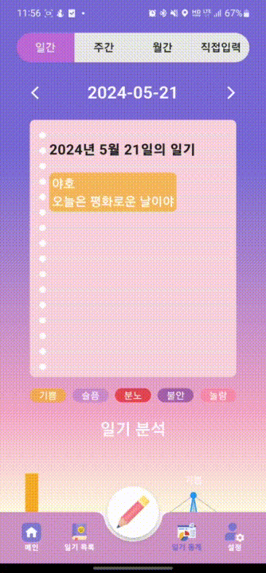
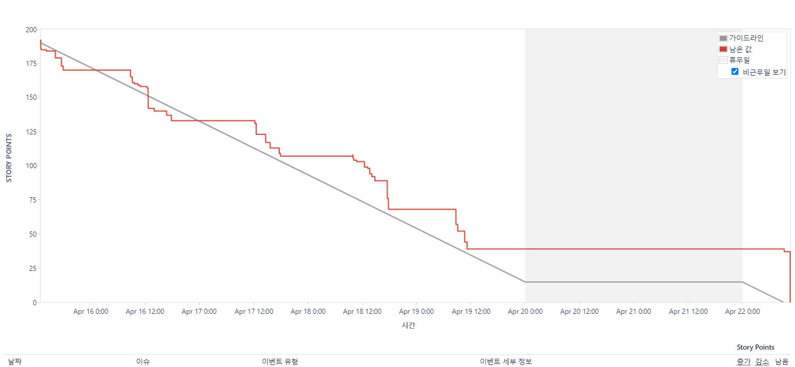
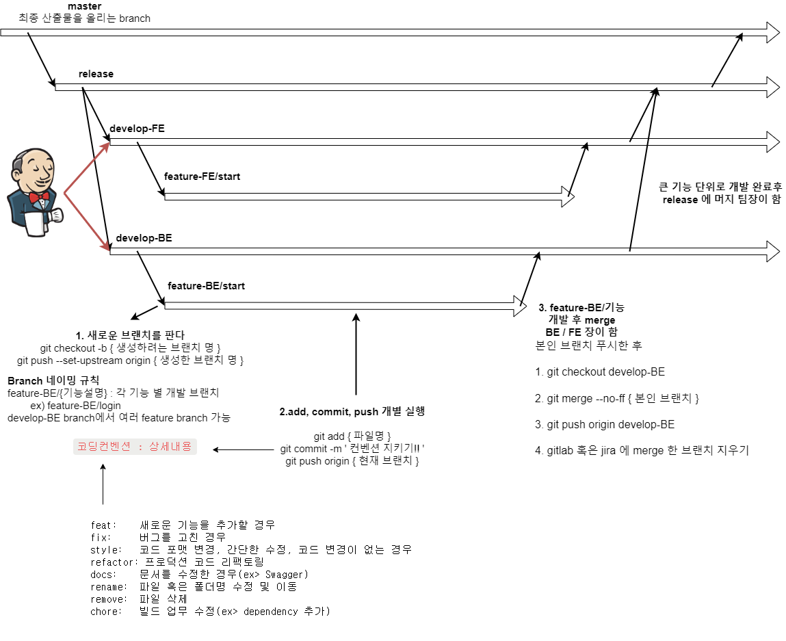
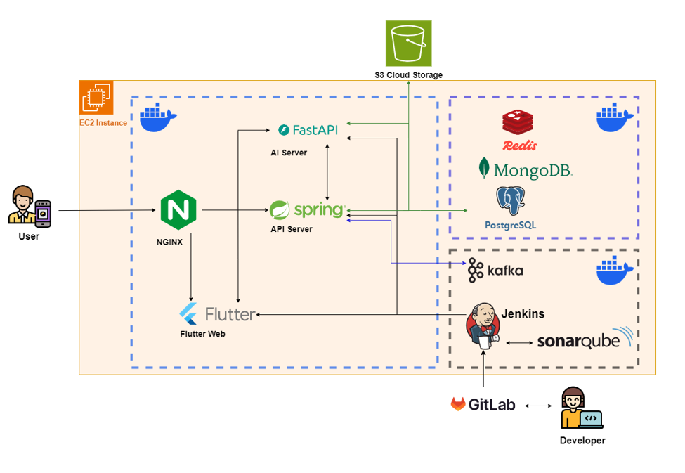
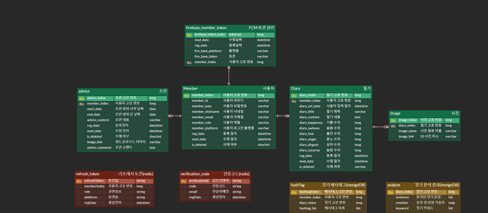

# Minda

 

## 소개

일기 감정 추출 및 분석, 조언 제공 어플리케이션

 

## 기술 스택

### FrontEnd

### BackEnd

### Infra

### AI

### 협업 툴

  

# 목차

1. [개요](#개요)
2. [주요 기능](#주요-기능)
3. [서비스 화면](#서비스-화면)
4. [협업 환경](#협업-환경)
5. [기술 소개](#기술-소개)
6. [팀원 소개](#팀원-소개)

  

## 개요

프로젝트 개발기간

**_2024.04.08 ~ 2024.05.20 (7주)_**

프로젝트 개요

- 작성한 일기를 더 가치 있게, 시각화 및 조언을 받으며 의미 있는 과거 성찰을 진행해봐요.

## 주요 기능

- 기본 일기 작성 기능(날짜에 따른 일기 작성 및 확인) 
- AI 일기 분석 및 통계 기능 
- Kobert 모델을 이용한 감정 분석 기능 
- 조언 기능(일기 분석 내용을 기반으로 조언 생성) 
- KoGPT2를 이용한 챗봇
- Dall-E AI 이미지 생성, 워드 클라우드 기능을 통한 다양한 시각화 기능 

 

## 서비스 화면

<table width="100%" border-style="non" cellspacing="0" cellpadding="100">
  <tr>
    <td align="center"></td>
    <td align="center"></td>
    <td align="center"></td>
  </tr>
  <tr>
    <td align="center"></td>
    <td align="center"></td>
    <td align="center"></td>
  </tr>
</table>

  

## 협업 환경

### JIRA

매주 월요일 오전 9시 30분 스프린트 회의를 통해 그 전주의 이슈를 공유하고 이번주 목표를 세우고 목표 달성을 위한 구체적인 작업을 정리합니다.

공통적인 일정 관리와 파트별 회의, 개인 개발 일정까지 모두 공유하며 구체적으로 이슈를 관리합니다.

이를 위해 사용된 요소들은 다음과 같습니다.

- Epic : `FE`, `BE`, `INFRA` 
  각 에픽에 맞게 스토리 및 태스크를 작성하였습니다.
- 번다운 차트
  

### GIT

컨벤션 설정을 통해 규칙을 정하고 GERRIT을 함께 활용하여 서로의 코드에 코멘트를 남겨 보완할 수 있도록 합니다.

- GIT 컨벤션
  

### Notion

`기능명세서`, `일정`, `이슈 발생 상황`, `환경설정 메뉴얼 ` 등 프로젝트 문서들을 공유 공간에서 통합적으로 관리하고 효과적으로 의사소통합니다.

  

### 시스템 구성도

 

### ERD

  

# 팀원 소개

**FRONTEND**

` 한지원` : 디자인 및 일기 목록, 확인 구현  
`강보훈(Team 리더 ,FE 리더)`: Flutter 레이아웃 및 유저 기능 구현  
`윤건웅` : 일기 분석 페이지 구현  

**BACKEND**

`이효재`: (BE 리더) | Spring API | AI | FastAPI(Python) API | DB 아키텍쳐 설계  
`김소연` : Spring API | 외부 API 호출 비동기 처리 및 비즈니스 로직 구현  
`정지훈` : Infra | Spring API | AI | System 아키텍처 설계 | Security | CI/CD

# 배포 주소

**안드로이드 앱 : [구글 드라이브](https://drive.google.com/file/d/1p53AnhI4_Ye-H5iEMpogTAOo3zGVZWHP/view?usp=drive_link)**

**웹사이트 : [coldiary.co.kr](https://coldiary.co.kr)**
